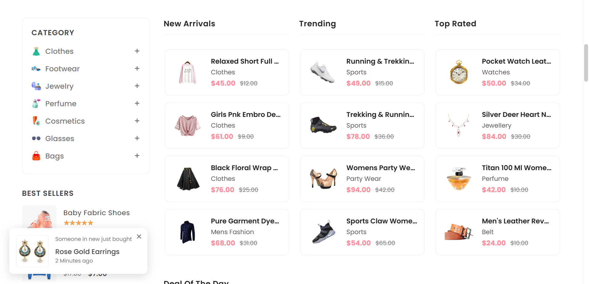

# Anon - An eCommerce Website


[](https://twitter.com/intent/follow?screen_name=harsha)

Anon is a fully responsive eCommerce website with maximum compatibility across all mobile devices, built using **HTML, CSS, and JavaScript**.

## Demo

  


## Prerequisites

Before you begin, ensure you have met the following requirements:

* [Git](https://git-scm.com/downloads "Download Git") must be installed on your operating system.

## Installing Anon

To install **Anon**, follow these steps:

Linux and macOS:

```bash
sudo git clone https://github.com/harsha/anon-ecommerce-website.git
